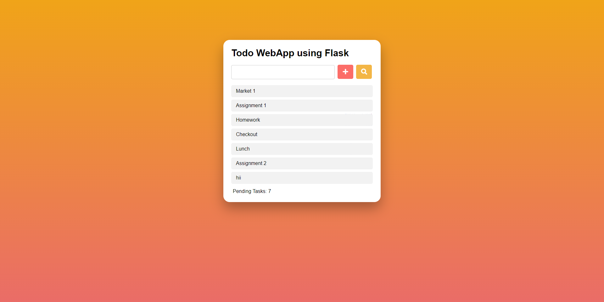
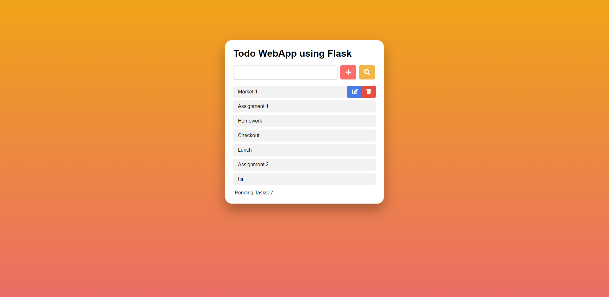
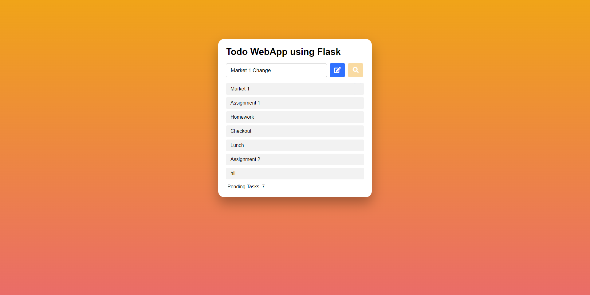

# Todo-Flask
Implemented a Todo list using Flask web Framework which is a python module that lets you develop web applications easily. It’s has a small and easy-to-extend.

## Technology Stack :
* HTML
* CSS
* Bootstrap
* Python-Flask

## Quick Start
Start the server using by running app.py in the console
```
$ python app.py
```

## Output Screenshots
### Todo List


### Edit Delete buttons

Edit and Delete icons pop up when the cursor is hovered on a task

### Edit Task

If edit icon is clicked we can change the task and the changes will reflect on the todo list
